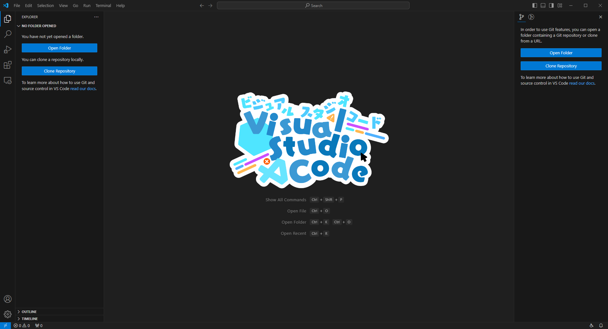

# Replace the VS Code watermark



## Installation

1. Install the following extensions:
   - [Custom CSS and JS Loader](https://marketplace.visualstudio.com/items?itemName=be5invis.vscode-custom-css)
   - [Fix VSCode Checksums Next](https://marketplace.visualstudio.com/items?itemName=RimuruChan.vscode-fix-checksums-next)
2. Add the following to your settings JSON file:
   ```json
   "vscode_custom_css.imports": [
     "https://raw.githubusercontent.com/Aikoyori/ProgrammingVTuberLogos/main/ReplaceGuide/VSCode/style.css"
   ]
   ```
3. Run the following commands:
   - _Enable Custom CSS and JS_
   - _Fix Checksums: Apply_
4. Restart Visual Studio Code

## Uninstallation

1. Remove the `vscode_custom_css.imports` section from your settings JSON file
2. Run the following commands:
   - _Disable Custom CSS and JS_
   - _Fix Checksums: Restore_
3. Uninstall the _Custom CSS and JS Loader_ and _Fix VSCode Checksums Next_ extensions
4. Restart Visual Studio Code
